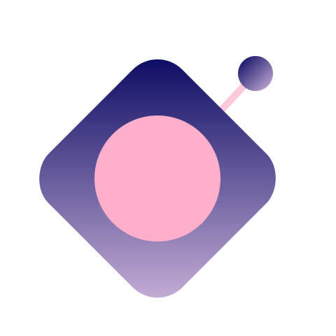

<div align="center">
  
</div>

<div align="center">
  <h1>remoteloop</h1>
  <p>Control your PC mouse from your phone over Wi-Fi.</p>
</div>

<div align="center">
  <sub>Built with <a href="https://tauri.app/">Tauri v2</a>, <a href="https://docs.rs/axum">axum</a>, and <a href="https://docs.rs/enigo">enigo</a></sub>
</div>

---

## How It Works

1. App starts silently in the system tray
2. Left-click tray icon → opens a small window with a QR code
3. Phone scans QR → opens a touch-enabled web page served from the PC
4. Phone sends touch events over WebSocket → desktop simulates mouse movement and clicks
5. Right-click tray icon → Quit

## Setup

**Requirements:** Rust (stable-x86_64-pc-windows-msvc) + VS Build Tools with C++ workload.

```bash
# Run in development mode (rebuilds on file changes)
cargo tauri dev

# Build production binary
cargo tauri build

# Check for compile errors without building
cargo check
```

## Recommended IDE Setup

[VS Code](https://code.visualstudio.com/) + [Tauri](https://marketplace.visualstudio.com/items?itemName=tauri-apps.tauri-vscode) + [rust-analyzer](https://marketplace.visualstudio.com/items?itemName=rust-lang.rust-analyzer)
